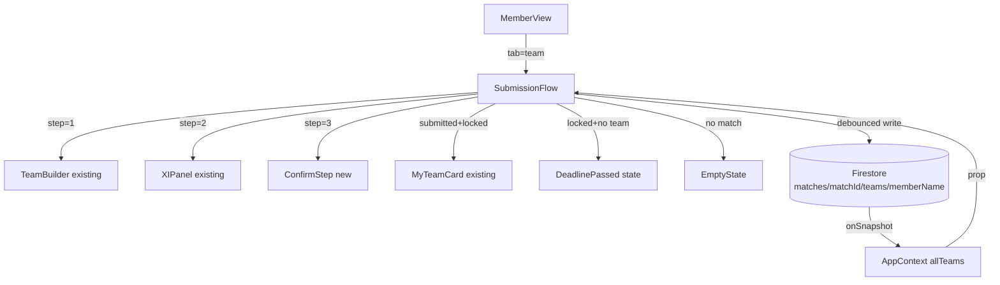
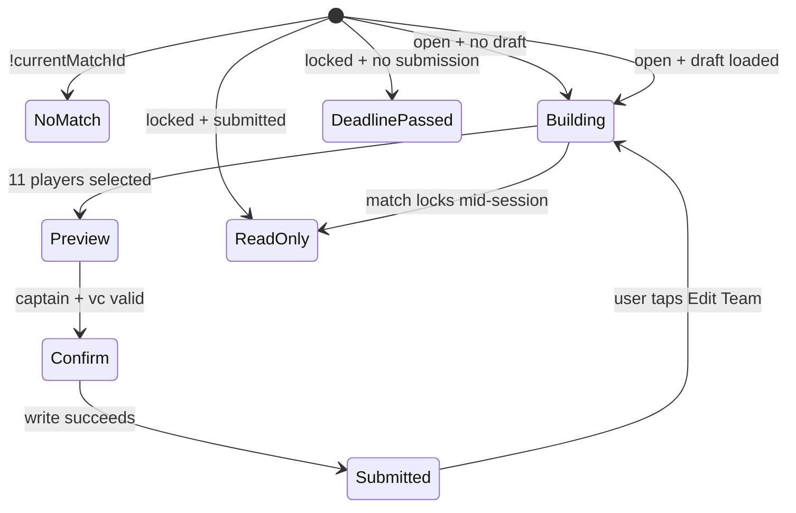

# Design Document: Team Selection & Submission

## Overview

This feature introduces a structured, multi-step team submission flow to the fantasy cricket app's member view. The flow replaces the current ad-hoc `TeamBuilder` + `XIPanel` + `MyTeamCard` arrangement with a cohesive `SubmissionFlow` component that guides members through three sequential steps: **Build XI → Preview & Pick Captain → Confirm & Submit**.

Key design goals:

- Preserve all existing components (`TeamBuilder`, `XIPanel`, `MyTeamCard`, `PlayerGrid`) as building blocks — the new `SubmissionFlow` orchestrates them rather than replacing them.
- Enforce submission deadlines via real-time Firestore `onSnapshot` listeners already wired in `AppContext`.
- Auto-save drafts to Firestore with debouncing to avoid excessive writes.
- Reveal teams only after the toss, consistent with the existing `match.revealed` flag.
- Keep the `MemberView` tab structure intact, adding "My Team" as the first tab.

---

## Architecture

The feature is a thin orchestration layer on top of existing components. No new Firebase collections are needed — team data continues to live at `matches/{matchId}.teams.{memberName}`.



### State Machine

The `SubmissionFlow` renders one of several distinct UI states based on match and team state:



---

## Components and Interfaces

### New: `SubmissionFlow`

**Path:** `src/components/member/SubmissionFlow.jsx`

Orchestrates the multi-step flow. Owns the `step` state and the debounced draft-save logic.

```js
// Props
{
  db,               // Firestore instance
  currentMatchId,   // string
  currentMatch,     // object { locked, revealed, finalized, label, ... }
  matchPlayers,     // array of player objects
  allTeams,         // object keyed by memberName
  allMembers,       // object keyed by memberName
  session,          // string — logged-in member name
  isIPL,            // boolean
  localTeam,        // { players, captain, vc }
  setLocalTeam,     // setter
  showToast,        // (msg, type?) => void
}
```

Internal state:

- `step` — `1 | 2 | 3` (only relevant when building)
- `saving` — boolean, shown as "Saving…" / "Saved" indicator
- `saveError` — boolean

### New: `ConfirmStep`

**Path:** `src/components/member/ConfirmStep.jsx`

Read-only summary rendered on Step 3. Shows full XI grouped by role, C/VC badges, credits used, and the "Submit Team" button.

```js
// Props
{
  team,          // { players, captain, vc }
  matchPlayers,  // array
  onSubmit,      // async () => void
  onBack,        // () => void
  submitting,    // boolean
}
```

### Modified: `MemberView`

- Adds "My Team" as the first tab (index 0).
- Replaces the inline `renderTeamTab()` logic with `<SubmissionFlow ... />`.
- Passes all required props through from `AppContext`.

### Existing components (unchanged interface)

| Component     | Role in new flow                                                                               |
| ------------- | ---------------------------------------------------------------------------------------------- |
| `TeamBuilder` | Step 1 — player selection grid + budget bar                                                    |
| `XIPanel`     | Step 2 — XI list + C/VC selectors (lock button hidden; navigation handled by `SubmissionFlow`) |
| `MyTeamCard`  | Post-submission read-only card                                                                 |
| `PlayerGrid`  | Used inside `TeamBuilder` as before                                                            |

---

## Data Models

### Firestore Team Document

Written to `matches/{matchId}.teams.{memberName}`:

```ts
interface TeamDoc {
  players: string[]; // exactly 11 player names
  captain: string; // player name
  vc: string; // player name, !== captain
  submitted: boolean; // true once confirmed
  submittedAt: number; // Date.now() at submission
  updatedAt: number; // Date.now() at every write (draft or submit)
}
```

Draft writes use the same schema with `submitted: false`. Submission writes set `submitted: true` and record `submittedAt`.

### Local Team State (existing shape, unchanged)

```ts
interface LocalTeam {
  players: string[];
  captain: string;
  vc: string;
  _memberName?: string; // injected by MemberView before passing to builder
}
```

### Match State Flags (existing, read-only from Firestore)

| Flag        | Type    | Meaning                                   |
| ----------- | ------- | ----------------------------------------- |
| `locked`    | boolean | No more edits allowed                     |
| `revealed`  | boolean | Teams visible to all members              |
| `finalized` | boolean | Match complete; implies locked + revealed |

---

## Correctness Properties

_A property is a characteristic or behavior that should hold true across all valid executions of a system — essentially, a formal statement about what the system should do. Properties serve as the bridge between human-readable specifications and machine-verifiable correctness guarantees._

### Property 1: Next button gated by player count

_For any_ team selection state on Step 1, the "Next" button should be enabled if and only if exactly 11 players are selected; for any count fewer than 11, the button should be disabled and the displayed remaining count should equal `11 - selected.length`.

**Validates: Requirements 2.3, 2.4**

---

### Property 2: Step 2 Next button gated by valid captain/vc

_For any_ team state on Step 2, the "Next" button should be disabled when captain is empty or when captain equals vc, and enabled only when both are set and distinct.

**Validates: Requirements 2.6**

---

### Property 3: Back navigation preserves selections

_For any_ team state, navigating forward from Step 1 to Step 2 (or Step 2 to Step 3) and then pressing Back should result in the same `players`, `captain`, and `vc` values as before navigation.

**Validates: Requirements 2.8**

---

### Property 4: Draft write triggered on selection change

_For any_ modification to `players`, `captain`, or `vc`, a Firestore write should be triggered with `submitted: false` and an `updatedAt` timestamp, and the write should occur within the debounce window.

**Validates: Requirements 3.1**

---

### Property 5: Submission validates before writing

_For any_ team state, tapping "Submit Team" should call `validateTeam`; if it returns a non-null error string, no Firestore write should occur and the error should be surfaced as a toast; if it returns null, the write should proceed with `submitted: true`.

**Validates: Requirements 4.1, 4.2, 9.4**

---

### Property 6: Submission write schema correctness

_For any_ valid team that is submitted, the Firestore document written to `matches/{matchId}.teams.{memberName}` should contain all required fields: `players` (array of 11 strings), `captain` (string), `vc` (string, !== captain), `submitted` (true), `submittedAt` (number), `updatedAt` (number).

**Validates: Requirements 4.3, 9.1**

---

### Property 7: Team data round-trip integrity

_For any_ valid team object written to Firestore, reading the document back should produce an object with identical `players`, `captain`, `vc`, and `submitted` values.

**Validates: Requirements 9.2, 3.2**

---

### Property 8: Graceful handling of malformed Firestore data

_For any_ Firestore document that is missing one or more of `players`, `captain`, or `vc`, the `SubmissionFlow` should not throw an error and should treat the document as an empty draft (empty players array, empty captain/vc strings).

**Validates: Requirements 9.3**

---

### Property 9: Edit controls reflect lock state

_For any_ match state, the "Edit Team" button should be present if and only if the team is submitted and `match.locked` is false; when `match.locked` is true, the button should be absent and a locked indicator should be shown instead.

**Validates: Requirements 5.1, 5.4, 6.1, 6.2, 7.3**

---

### Property 10: Locked match rejects submit/edit actions

_For any_ attempt to submit or edit a team when `match.locked` is true, the action should be rejected (no Firestore write), and an error toast should be displayed.

**Validates: Requirements 6.3**

---

### Property 11: Credit bar and role summary reflect current selection

_For any_ player selection state on Step 1, the displayed credits-used value should equal `teamSpend(players)`, the remaining credits should equal `BUDGET - teamSpend(players)`, and each role count pill should equal the actual count of that role in the current selection.

**Validates: Requirements 10.1, 10.2, 10.3**

---

### Property 12: Status label matches match state

_For any_ match state, the status label displayed should be "Open" when `!locked && !revealed`, "Toss Done" when `revealed && !locked`, and "Locked" when `locked` is true.

**Validates: Requirements 10.4**

---

### Property 13: C/VC badges on Step 3 summary

_For any_ team on Step 3, the player rendered as captain should have a "C" badge and the player rendered as vice-captain should have a "VC" badge; no other player should have either badge.

**Validates: Requirements 10.5**

---

### Property 14: Re-submission updates submittedAt

_For any_ team that has been submitted once and is then edited and re-submitted, the new Firestore write should have `submitted: true` and a `submittedAt` value greater than or equal to the previous `submittedAt`.

**Validates: Requirements 5.3**

---

## Error Handling

### Firestore Write Failures

Both draft saves and submission writes can fail due to network issues or permission errors.

- **Draft save failure**: Show an error toast via `showToast`, set `saveError: true` to display a warning indicator, and retain the current `localTeam` state. The next selection change will re-trigger the debounced save.
- **Submission failure**: Show an error toast, remain on Step 3, and keep the "Submit Team" button active so the member can retry. Do not clear `localTeam`.

### Validation Errors

`validateTeam` returns a human-readable error string for any invalid team. The `SubmissionFlow` passes this string directly to `showToast` and stays on Step 3.

### Malformed Firestore Data

When reading `allTeams[session]` from the Firestore snapshot, the component defensively defaults all fields:

```js
const myTeam = allTeams[session] || {};
const players = Array.isArray(myTeam.players) ? myTeam.players : [];
const captain = typeof myTeam.captain === "string" ? myTeam.captain : "";
const vc = typeof myTeam.vc === "string" ? myTeam.vc : "";
```

This prevents crashes when a document is partially written or corrupted.

### Match State Transitions Mid-Session

The `onSnapshot` listener in `AppContext` pushes `currentMatch` updates in real time. If the match locks while a member is on Step 1, 2, or 3:

- The `SubmissionFlow` detects `match.locked` on the next render.
- It immediately transitions to the read-only locked view.
- Any pending debounced draft save is cancelled (the write would be rejected by Firestore security rules anyway).

---

## Testing Strategy

### Dual Testing Approach

Both unit tests and property-based tests are required. They are complementary:

- **Unit tests** cover specific examples, integration points, and error conditions.
- **Property-based tests** verify universal correctness across all valid inputs.

### Property-Based Testing

**Library**: [fast-check](https://github.com/dubzzz/fast-check) (JavaScript/React ecosystem, well-maintained, works with Jest/Vitest).

Each property test must run a minimum of **100 iterations** (fast-check default is 100; set explicitly with `{ numRuns: 100 }`).

Each test must include a comment referencing the design property it validates:

```
// Feature: team-selection-submission, Property N: <property_text>
```

**Property test targets** (one test per property):

| Property | Test description                                                                     |
| -------- | ------------------------------------------------------------------------------------ |
| P1       | Generate random player counts 0–10; assert Next disabled and count correct           |
| P2       | Generate random captain/vc combos; assert Next enabled iff both set and distinct     |
| P3       | Generate random team state; navigate forward then back; assert state unchanged       |
| P4       | Generate random selection changes; assert debounced write fires with submitted=false |
| P5       | Generate random teams (valid and invalid); assert validateTeam gates the write       |
| P6       | Generate valid teams; assert written doc has all required fields with correct types  |
| P7       | Generate valid teams; write then read; assert round-trip equality                    |
| P8       | Generate partial/empty Firestore docs; assert no crash and empty draft state         |
| P9       | Generate match.locked values; assert Edit button presence matches !locked            |
| P10      | Generate submit/edit actions with locked=true; assert no write and toast shown       |
| P11      | Generate player selections; assert credit bar and role pills match computed values   |
| P12      | Generate match state combos; assert status label matches expected string             |
| P13      | Generate teams on Step 3; assert exactly captain has C badge and vc has VC badge     |
| P14      | Generate two sequential submissions; assert second submittedAt >= first              |

### Unit Tests

Unit tests focus on:

- **Specific examples**: Empty state (no match), deadline passed state, success confirmation render.
- **Integration points**: `SubmissionFlow` correctly passes props to `TeamBuilder`, `XIPanel`, `MyTeamCard`.
- **Error conditions**: Toast shown on draft save failure, toast shown on submission failure, retry button present after failure.
- **State transitions**: Edit Team re-enters Step 1 with pre-populated selections; successful submission transitions to MyTeamCard view.

Avoid writing unit tests that duplicate property test coverage (e.g., don't write a unit test for "Next disabled when 5 players selected" — the property test covers all counts).

### Test File Structure

```
src/
  components/member/
    __tests__/
      SubmissionFlow.test.jsx     # unit tests
      SubmissionFlow.pbt.test.jsx # property-based tests
      ConfirmStep.test.jsx        # unit tests for ConfirmStep
```
